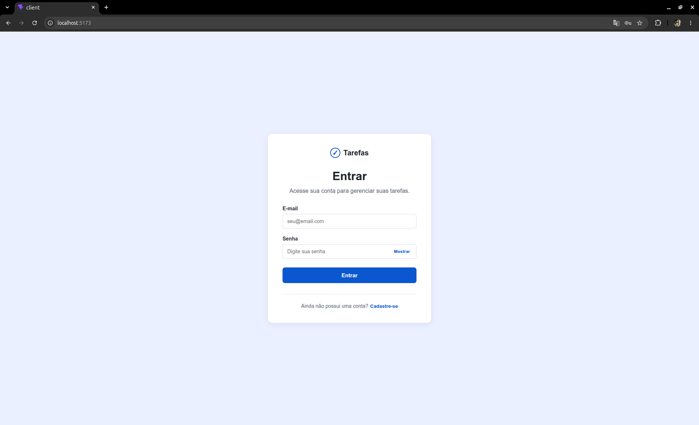
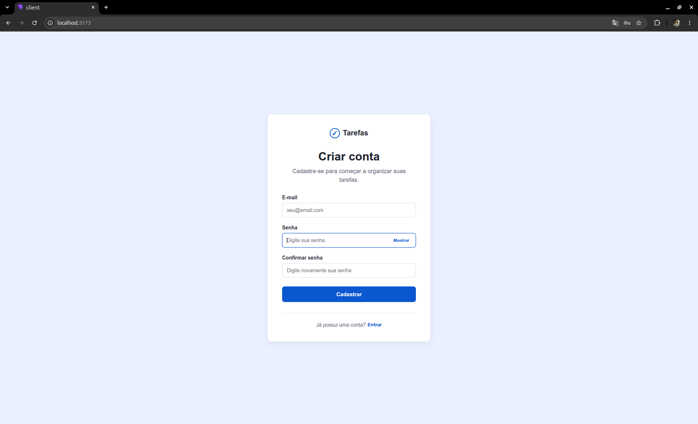
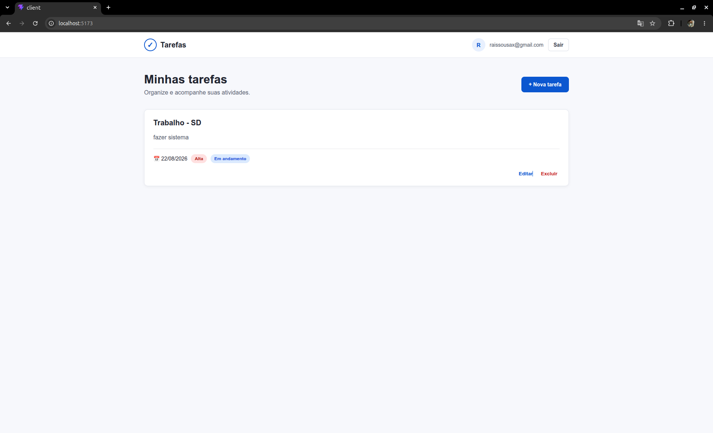
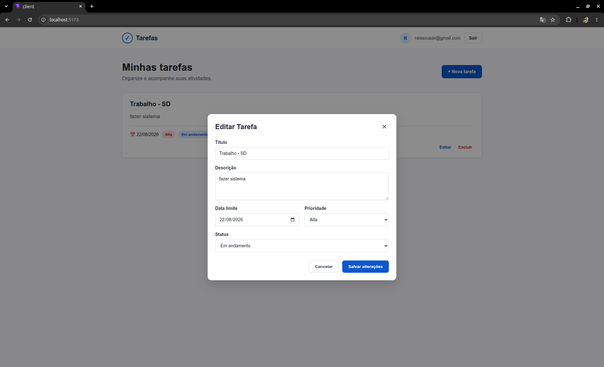
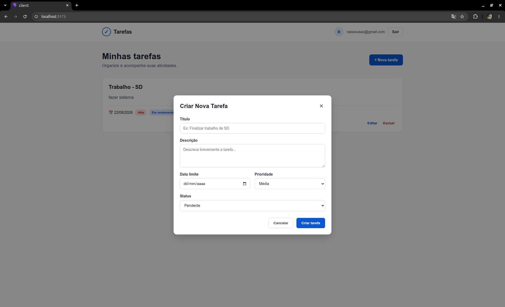
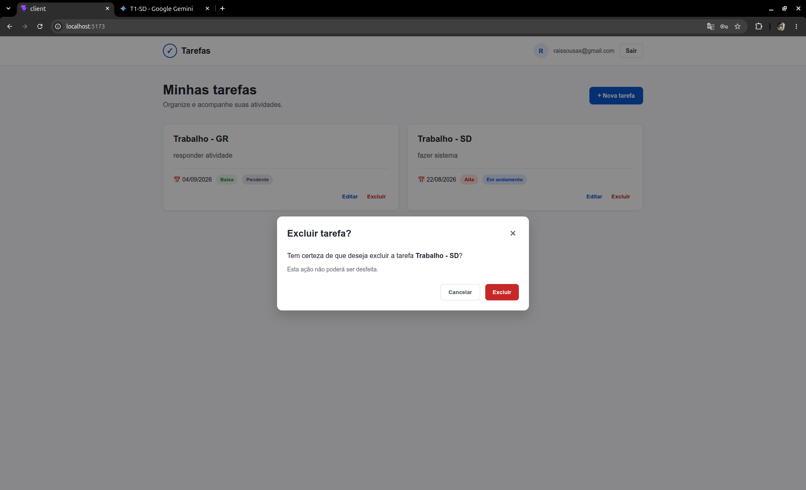

# Sistemas Distribuídos - Trabalho 01

Sistema distribuído de gerenciamento de tarefas desenvolvido como trabalho da disciplina de Sistemas Distribuídos.

A aplicação permite que usuários realizem cadastro e autenticação, além de criar, visualizar, editar e excluir suas próprias tarefas.

## Tecnologias

### Frontend

- React
- Vite
- JavaScript
- Supabase Auth

### Backend

- Python
- FastAPI
- Supabase
- PostgreSQL
- Pytest

## Estrutura do Projeto

```text
Sistemas_Distribuidos_T1/
│
├── client/             # Frontend React
├── server/             # Backend FastAPI
├── docs/               # Documentação
├── .gitignore
└── README.md
```

## Funcionalidades

- Cadastro de usuário
- Login com e-mail e senha
- Persistência da sessão
- Logout
- Listagem de tarefas
- Criação de tarefas
- Edição de tarefas
- Exclusão de tarefas
- Confirmação antes da exclusão
- Isolamento das tarefas por usuário
- Mensagens de sucesso e erro
- Estado vazio quando não existem tarefas

## Telas da Aplicação

### Tela de Login


### Tela de Cadastro


### Listagem de Tarefas


### Editar Tarefa


### Criação de Tarefas


### Excluir


## Arquitetura

O frontend React utiliza o Supabase Auth para autenticação dos usuários.

Após o login, o Supabase fornece um token JWT, que é enviado pelo frontend ao backend FastAPI através do cabeçalho:

```text
Authorization: Bearer <token>
```

O FastAPI valida o usuário e realiza as operações sobre as tarefas armazenadas no PostgreSQL através do Supabase.

Fluxo simplificado:

```text
React
  |
  | Supabase Auth
  v
JWT
  |
  v
FastAPI
  |
  v
Supabase / PostgreSQL
```

## Configuração do Frontend

Entre na pasta:

```bash
cd client
```

Instale as dependências:

```bash
npm install
```

Crie um arquivo `.env` baseado em `.env.example`:

```env
VITE_API_URL=http://localhost:8000/api
VITE_SUPABASE_URL=
VITE_SUPABASE_PUBLISHABLE_KEY=
```

Depois execute:

```bash
npm run dev
```

O frontend ficará disponível normalmente em:

```text
http://localhost:5173
```

## Configuração do Backend

Entre na pasta:

```bash
cd server
```

Crie o ambiente virtual:

```bash
python -m venv venv
```

### Windows

Ative com:

```powershell
.\venv\Scripts\Activate.ps1
```

### Linux/macOS

```bash
source venv/bin/activate
```

Instale as dependências:

```bash
pip install -r requirements.txt
```

Crie um arquivo `.env` baseado em `.env.example`:

```env
SUPABASE_URL=
SUPABASE_KEY=
```

A variável `SUPABASE_KEY` deve utilizar uma chave apropriada para execução no backend e nunca deve ser exposta no frontend ou versionada no Git.

Execute a API:

```bash
python -m uvicorn app.main:app --reload --port 8000
```

A documentação Swagger estará disponível em:

```text
http://127.0.0.1:8000/docs
```

## API

Principais endpoints:

| Método | Endpoint | Descrição |
|---|---|---|
| GET | `/api/tarefas` | Lista as tarefas do usuário |
| POST | `/api/tarefas` | Cria uma nova tarefa |
| GET | `/api/tarefas/{id}` | Consulta uma tarefa |
| PUT | `/api/tarefas/{id}` | Atualiza uma tarefa |
| DELETE | `/api/tarefas/{id}` | Exclui uma tarefa |

Todos os endpoints de tarefas exigem autenticação.

## Testes do Backend

### Como Instalar Dependências e Executar

1. Certifique-se de estar com o ambiente virtual ativo na pasta `server/`:
   ```bash
   cd server
   source venv/bin/activate  # No Linux/macOS
   # .\venv\Scripts\Activate.ps1  # No Windows
   pip install -r requirements.txt

para executar: pytest -v

Resultado dos testes

============================= test session starts ==============================
rootdir: /home/rais/Documentos/SD/Sistemas_Distribuidos_T1-integration-fullstack/server
configfile: pyproject.toml
plugins: anyio-4.8.0
collected 7 items

tests/test_auth.py::test_acesso_sem_token_deve_falhar PASSED            [ 14%]
tests/test_auth.py::test_acesso_token_invalido_deve_falhar PASSED       [ 28%]
tests/test_tarefas.py::test_criar_tarefa_sucesso PASSED                 [ 42%]
tests/test_tarefas.py::test_criar_tarefa_dados_invalidos PASSED         [ 57%]
tests/test_tarefas.py::test_listar_tarefas PASSED                       [ 71%]
tests/test_tarefas.py::test_atualizar_tarefa PASSED                     [ 85%]
tests/test_tarefas.py::test_deletar_tarefa PASSED                       [100%]

============================== 7 passed in 0.42s ===============================

### Descrição dos Grupos de Testes

- **Grupo 1: Autenticação e Autorização (`tests/test_auth.py`)**[cite: 5]
  - **Objetivo:** Validar a proteção dos endpoints e a integridade da autenticação por Bearer Token[cite: 2, 4].
  - `test_acesso_sem_token_deve_falhar`: Garante que chamadas sem token sejam bloqueadas com status `401 Unauthorized`[cite: 2, 5].
  - `test_acesso_token_invalido_deve_falhar`: Garante que tokens falsificados ou expirados sejam rejeitados com status `401 Unauthorized`[cite: 2, 5].

- **Grupo 2: Operações CRUD de Tarefas (`tests/test_tarefas.py`)**[cite: 5]
  - **Objetivo:** Validar persistência, validação de payload, regras de negócio e isolamento de dados por usuário[cite: 2, 4].
  - `test_criar_tarefa_sucesso`: Valida a criação via `POST /api/tarefas` retornando `201 Created` e os dados persistidos[cite: 2, 5].
  - `test_criar_tarefa_dados_invalidos`: Valida a rejeição de dados incorretos com status `422 Unprocessable Entity`[cite: 2, 5].
  - `test_listar_tarefas`: Valida a listagem via `GET /api/tarefas` retornando `200 OK` apenas com registros do usuário[cite: 2, 4, 5].
  - `test_atualizar_tarefa`: Valida a alteração seletiva via `PATCH /api/tarefas/{id}` retornando `200 OK`[cite: 2, 5].
  - `test_deletar_tarefa`: Valida a exclusão via `DELETE /api/tarefas/{id}` retornando `204 No Content` e confirmando que a busca seguinte retorna `404 Not Found`[cite: 2, 5].
```[cite: 5]

## Build do Frontend

Para verificar a compilação do frontend:

```bash
cd client
npm run build
```

Para verificar o código com o linter:

```bash
npm run lint
```

## Segurança

Os arquivos `.env` não são versionados.

O frontend utiliza somente a chave pública do Supabase.

A chave secreta utilizada pelo backend deve permanecer exclusivamente no servidor e nunca deve ser enviada ao navegador ou incluída no repositório.

## EStrutura da Arquitetura em camadas

Apresentação 

    ↓
React + Vite


API

    ↓  
FastAPI

Regras de negócio / autorização
    
    ↓
Backend

Autenticação
    
    ↓
Supabase Auth

Persistência
    
    ↓
Shttps://github.com/RaisSousaa/Sistemas_Distribuidos_T1/pull/3/conflict?name=README.md&base_oid=3d6ecc02b84660aeba656b99407c035ef0777ebb&head_oid=75d50160549b300fdae48dfcbcf55fe1c0a66976upabase PostgreSQL


## Conceitos de Sistemas Distribuídos - Monitoria

Componentes: Quais partes independentes existem ?

-Temos frontend, backend, serviço de autenticação e banco de dados como componentes separados. Eles podem executar independentemente e se comunicam pela rede.

Compartilhamento: O que é compartilhamento?

-São compartilhados os serviços do sistema, como API, autenticação e banco de dados. Os usuários usam a mesma infraestrutura, mas cada um acessa somente suas próprias tarefas.

Tipo de SD: Computação, informação, pervasivo ou combianação?

-Classificamos como um Sistema Distribuído de Informação, porque diferentes componentes trabalham juntos para armazenar, consultar e gerenciar dados de usuários e tarefas.

Transparencia: O que o usuário não precisa saber ?

-A distribuição é transparente para o usuário. Ele não precisa saber onde estão o backend, banco ou autenticação; ele interage com tudo como se fosse uma única aplicação.

Escalabilidade: Como cresceria ?

-Se o número de usuários aumentar, podemos criar várias instâncias do backend e distribuir as requisições entre elas. O banco e a infraestrutura do Supabase também podem ser dimensionados conforme o crescimento.

Falha: O que acontece se um componente parar ?

-A falha de um componente pode afetar apenas determinada parte do sistema. Se a autenticação cair, por exemplo, o login deixa de funcionar; se o banco cair, as tarefas não podem ser consultadas. Como os componentes são separados, a falha de um deles não significa necessariamente que todos os outros também pararam.
